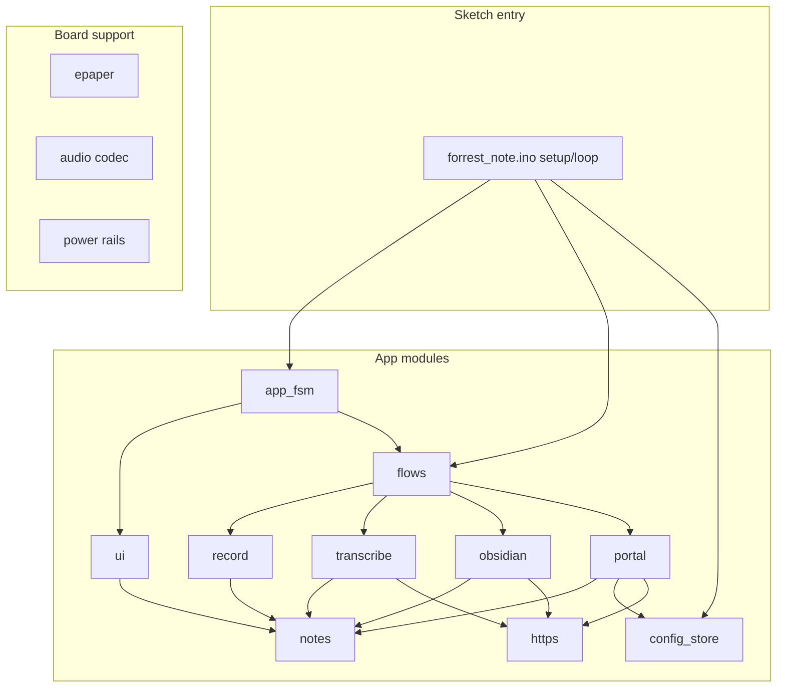
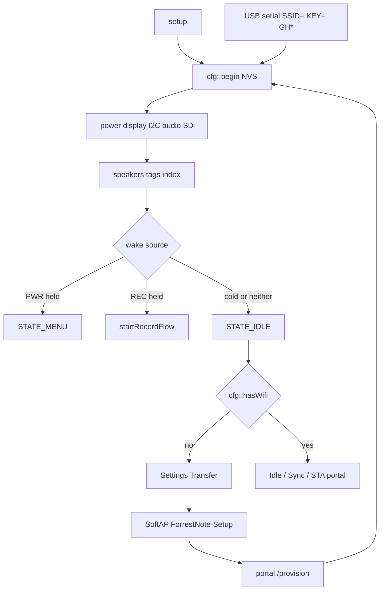
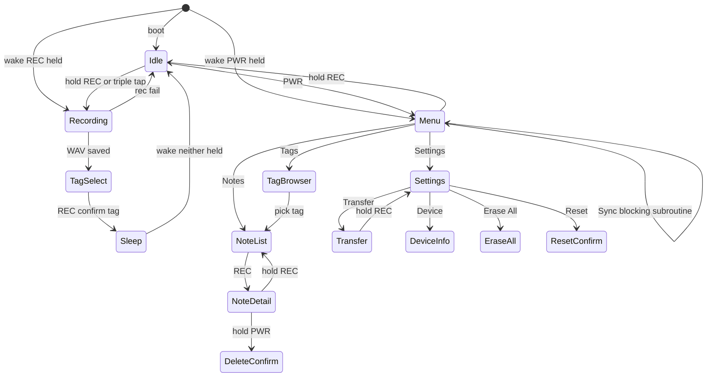
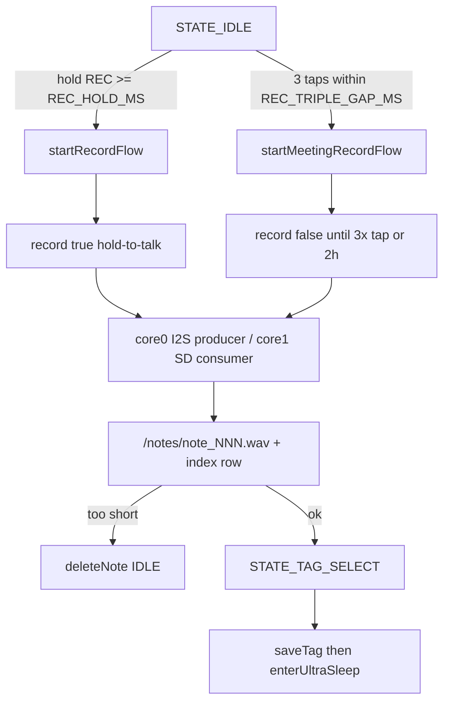
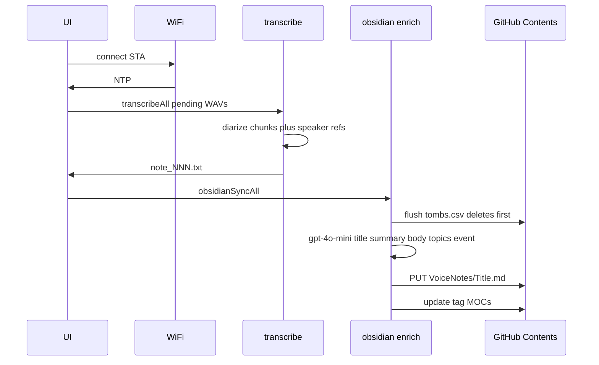
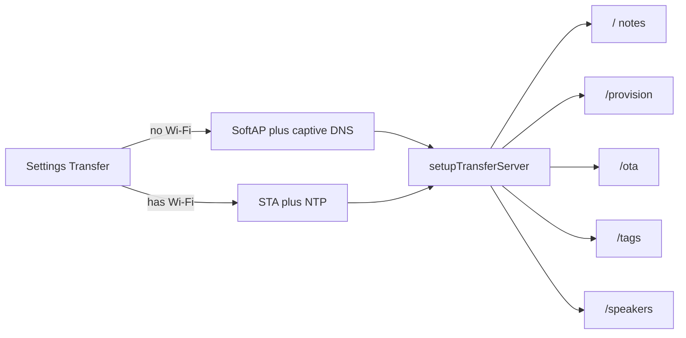

# Architecture

Firmware for the Forrest Note device: record voice on an ESP32-S3 e-paper board, diarize/transcribe with OpenAI, enrich into Markdown, and push to a GitHub repo for Obsidian.

This document is the map of **application** code under [`forrest_note/src/app/`](forrest_note/src/app/). Vendor BSP (`esp_codec_dev/`, `codec_board/`, `display/`, `i2c_bsp/`, `audio/`, `power/`) is hardware bring-up — leave it alone unless the board changes.

---

## Module map

The Arduino sketch (`forrest_note.ino`) owns `setup()`, `loop()`, and global storage. Everything else sits behind a small header in `src/app/`.

| Module | Owns | Public interface |
|---|---|---|
| [`https`](forrest_note/src/app/https.h) | Mozilla CA bundle + HTTP chunked decode | `httpsAttachCa`, `dechunkBody` |
| [`transcribe`](forrest_note/src/app/transcribe.h) | OpenAI diarize of pending WAVs | `transcribe`, `transcribeAll` |
| [`portal`](forrest_note/src/app/portal.h) | HTTP transfer / provision / OTA / speakers | `setupTransferServer`, `stopTransferMode` |
| [`obsidian`](forrest_note/src/app/obsidian.h) | AI enrich + GitHub Contents + tombstones | `obsidianSyncAll`, `obsidianFlushDeletes` |
| [`flows`](forrest_note/src/app/flows.h) | Record / meeting / sync / transfer | `start*Flow`, `startTransferMode` |
| [`app_fsm`](forrest_note/src/app/app_fsm.h) | Sleep timeout, ticker, battery, buttons | `appHandleLoop` |
| [`notes`](forrest_note/src/app/notes.h) | SD index, tags, `.meta`, vault uid | load/save/delete/meta helpers |
| [`record`](forrest_note/src/app/record.h) | WAV capture + playback | `record`, `playWavFile` |
| [`ui`](forrest_note/src/app/ui.h) | E-paper screens + ticker drawing | `show*`, `serviceDisplay` |
| [`config_store`](forrest_note/src/app/config_store.h) | NVS secrets | `cfg::*` |
| [`serial_cfg`](forrest_note/src/app/serial_cfg.h) | USB `SSID=`/`KEY=`/`GH*` | `handleSerialConfig` |

---

## Boot / provision

Three ways to write config; all go through `cfg::*` (NVS namespace `forrest`).

- **SoftAP:** Settings → Transfer when no Wi-Fi is stored. Captive DNS `*` → `/provision`.
- **STA portal:** same Transfer menu when Wi-Fi is stored; browse `http://<device-ip>/provision`.
- **USB:** every `loop()` runs `handleSerialConfig()` (`SSID=` then `PASS=`, `KEY=`, `GHTOKEN=`, …).

---

## UI state machine

`AppState` lives in [`types.h`](forrest_note/types.h). **Sync is not a state** — `startSyncFlow()` blocks while `state` stays `STATE_MENU`. **Sleep is not a state** — `enterUltraSleep()` is MCU deep-sleep. `STATE_SAVED` is a brief splash; `STATE_ERROR` is never assigned.

Idle REC uses `handleIdleRec()` (hold vs 3× tap). Every other screen uses `readButtonEvent()`. Meeting *stop* reimplements 3× tap inside `record()` — do not merge those two gesture loops; they share a pattern, not a lifecycle.

Default nav: **PWR tap** = next/cycle, **REC tap** = select, **REC hold** = back. Exceptions: Idle REC is capture; note detail **PWR hold** = delete; tag confirm always sleeps (no path back to idle without deep-sleep).

---

## Record pipeline

WAV header is rewritten on a crash-safe flush (`REC_FLUSH_MS`) so a power loss still leaves a playable file.

---

## Sync pipeline

Menu → Sync. Wi-Fi STA must already be configured. Vault deletes drain **first** inside `obsidianSyncAll()`.

Offline-first: failed diarize stays `hasText=false`; failed push stays `obsidian=0`; failed vault delete stays in `tombs.csv`.

Quirk: a **single** `deleteNote()` also calls `obsidianFlushDeletes()` immediately if Wi-Fi happens to be up. **Erase all** only queues tombs and waits for the next sync.

---

## Portal

One `WebServer` on port 80, started by `startTransferMode()`.

Hold REC to exit (`stopTransferMode()`). OTA uses the same CA bundle as OpenAI/GitHub (`httpsAttachCa`).
